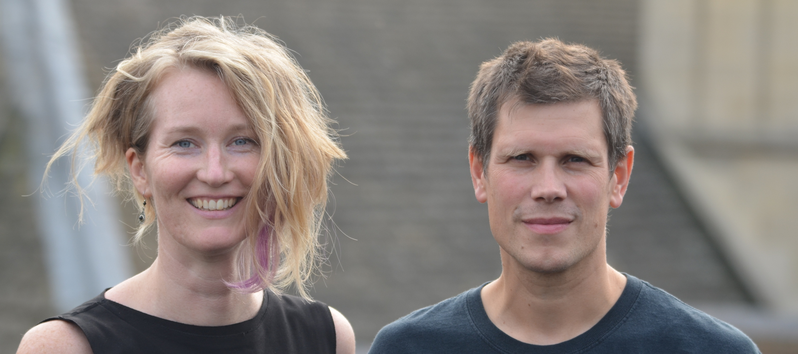

## I won't be #BulliedIntoBadScience!

```
Laurent Gatto                      Computational Proteomics Unit
https://lgatto.github.io           University of Cambridge
@lgatt0
```

Link to slides: http://bit.ly/20171112OpenCon

## Licence

These slides are available under a creative common
[CC-BY license](http://creativecommons.org/licenses/by/4.0/). You are
free to share (copy and redistribute the material in any medium or
format) and adapt (remix, transform, and build upon the material) for
any purpose, even commercially.


## Credit

- OpenConCam: OpenCon Cambridge group - http://www.openconcam.org/
- **Corina Logan** - @LoganCorina - http://corinalogan.com/



## [http://bulliedintobadscience.org/](http://BulliedIntoBadScience.org/)

> The Bullied Into Bad Science campaign is an initiative by early
  career researchers (ECRs) for early career researchers who aim for a
  fairer, more open and ethical research and publication environment.

- ERC: **135 have signed it**
- Other: **71 support it**

## [http://bulliedintobadscience.org/](http://BulliedIntoBadScience.org/)

> I have been constantly harassed by superiors to modify data in order
  to provide better agreement with known experimental values in order
  to make the paper look better for publishing at prestigious
  journals.

## Background

- Elsevier/JISC negociations - FAIL
- Discussions at the University of Cambridge - mixed results
- Informal discussions with pro VC - FAIL
- Going public with **#BulliedIntoBadScience**

## ECR struggle

- And my day job? Why do ECR need to fight for a **better**, open and
  more **trustworthy** research?
- What will be the impact on being an open activist on my career?

## Success?

- Numbers?
- Feedback - Yes
- In Cambridge - FAIL (and see next slide). But that doesn't matter,
  as long as others benefits. It never was meant to be a Cambridge
  thing anyway.

## Declaration on Research Assessment (DORA)

- Cambridge: yes? no? No! 
- "No way on God’s earth"
- Can we get a dicussion in the Regent House?

## Continuing the fight

- So much work, so little time.
- Evidence to the UK Parliament Science and Technology Committee
  inquiry on [Research
  Integrity](https://www.parliament.uk/business/committees/committees-a-z/commons-select/science-and-technology-committee/inquiries/parliament-2017/research-integrity-17-19/).
- Update our webpage, tranlsations, regular blog posts, ....

## Pick your battles

- There are too many fights to pick - pick yours.
- There are multiple ways to fight any battle, and often several are needed in parallel.
- Official path and community efforts.


